# BloxLogicAI Data Flow Diagram

This diagram (a Level 1 DFD) illustrates how information moves through the BloxLogicAI system. It tracks the journey of raw tea export data from the moment an administrator uploads it, through the AI and blockchain processing, until it is visualized for the end user.

```mermaid
flowchart LR
    %% Styling
    classDef process fill:#fff3e0,stroke:#f57c00,stroke-width:2px;
    classDef datastore fill:#f3e5f5,stroke:#7b1fa2,stroke-width:2px;
    classDef entity fill:#f9f9f9,stroke:#333,stroke-width:2px;

    %% Entities
    Admin(["Admin (Data Source)"]):::entity
    User(["End User (Data Consumer)"]):::entity
    
    %% Processes (Circles/Rounded rectangles usually in DFD)
    Proc1("1.0\nData Ingestion & Validation"):::process
    Proc2("2.0\nCryptographic Hashing"):::process
    Proc3("3.0\nAI Model Inference"):::process
    Proc4("4.0\nData Visualization"):::process
    
    %% Data Stores (Open ended rectangles, using cylinders here for Mermaid)
    DS1[("D1: Raw Datasets\n(CSV/Excel)")]:::datastore
    DS2[("D2: Blockchain Ledger\n(JSON)")]:::datastore
    DS3[("D3: Model Outputs\n(Memory)")]:::datastore
    
    %% Flow
    Admin -->|"1. Uploads Raw Tea Data"| Proc1
    Proc1 -->|"2. Stores Validated Data"| DS1
    
    Proc1 -->|"3. Sends New Data Payload"| Proc2
    Proc2 -->|"4. Appends SHA-256 Block"| DS2
    
    DS1 -->|"5. Feeds Historical Data"| Proc3
    Proc3 -->|"6. Generates Forecasts & Anomalies"| DS3
    
    DS2 -->|"7. Provides Verification Status"| Proc4
    DS3 -->|"8. Provides Analytical Data"| Proc4
    
    Proc4 -->|"9. Renders Interactive UI"| User
```

### Flow Breakdown:
1.  **Data Ingestion:** The Admin uploads a dataset. The Python backend validates the format and cleans any missing values.
2.  **Blockchain Hashing:** Simultaneously, the new data payload is sent to the Blockchain Manager, which calculates a new SHA-256 hash linking it to the previous block, storing it in `ledger.json`.
3.  **AI Inference:** The raw data from the CSV is passed into the Prophet and Isolation Forest models. These models crunch the numbers and output their predictions and anomalies into memory.
4.  **Visualization:** The Streamlit frontend pulls the AI results and the Blockchain integrity status, rendering them into the interactive charts the end user sees.
