# BloxLogicAI Sequence Diagrams

This document contains the sequence diagrams for all major processes within the BloxLogicAI system.

---

## 1. Authentication Processes (Common)

### 1.1 User Signup
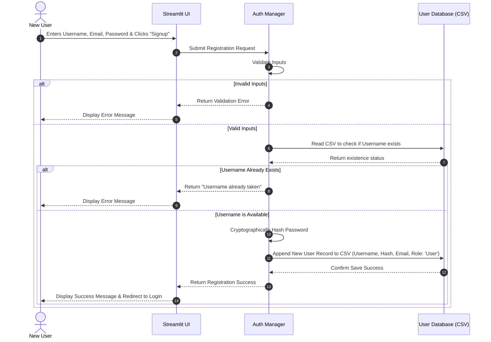

### 1.2 User Login
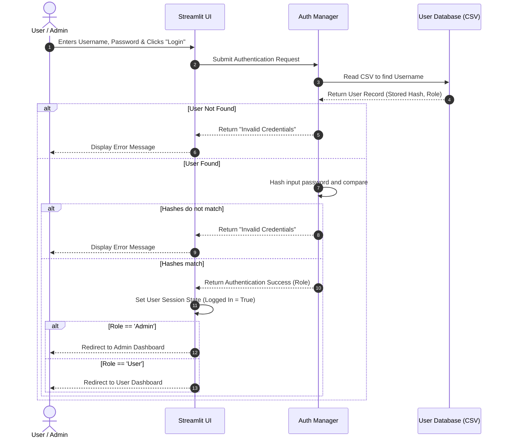

### 1.3 User Signout
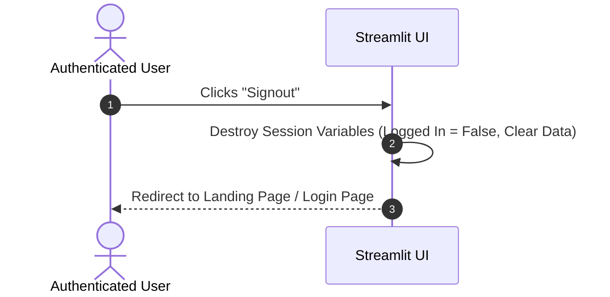

---

## 2. End-User Processes

### 2.1 View & Download Forecast Data
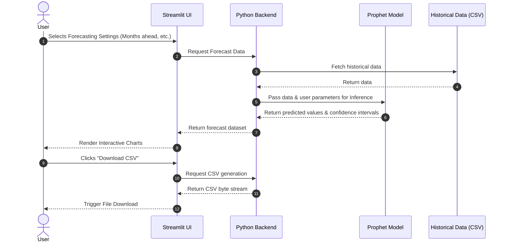

### 2.2 View Anomalies & Suggestions
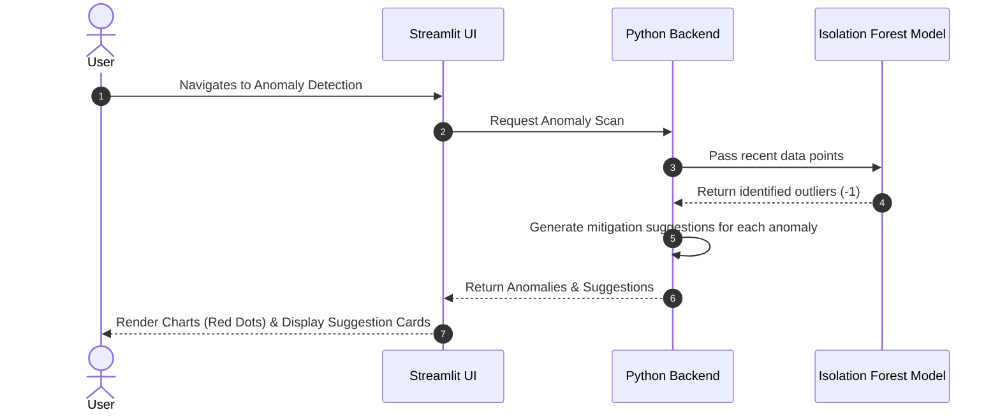

### 2.3 Verify Tea Batches (QR / Batch Number)
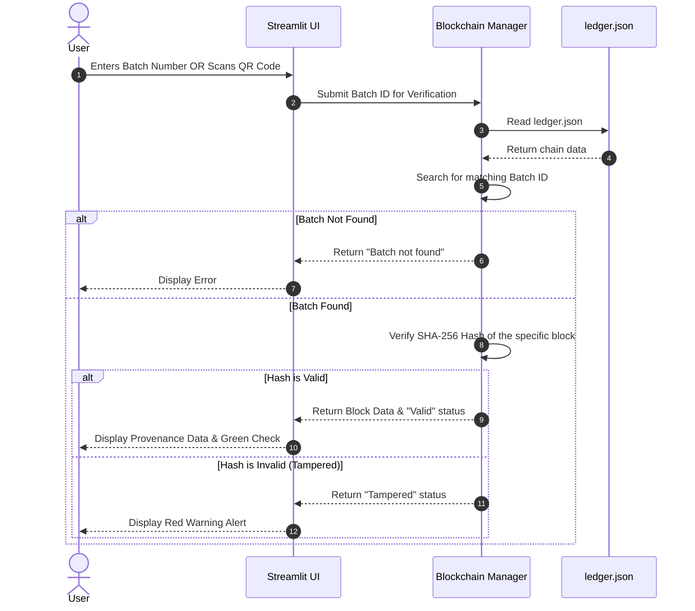

### 2.4 Manage Profile (Update Email / Password)
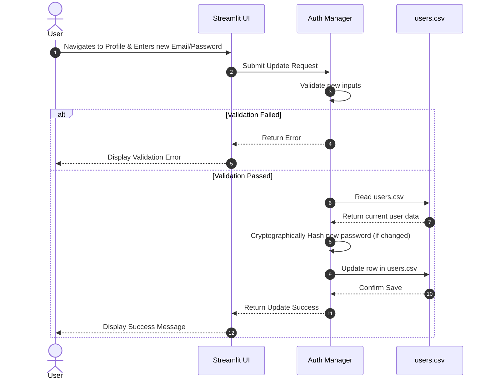

---

## 3. Administrator Processes

### 3.1 Train & Retrain Models
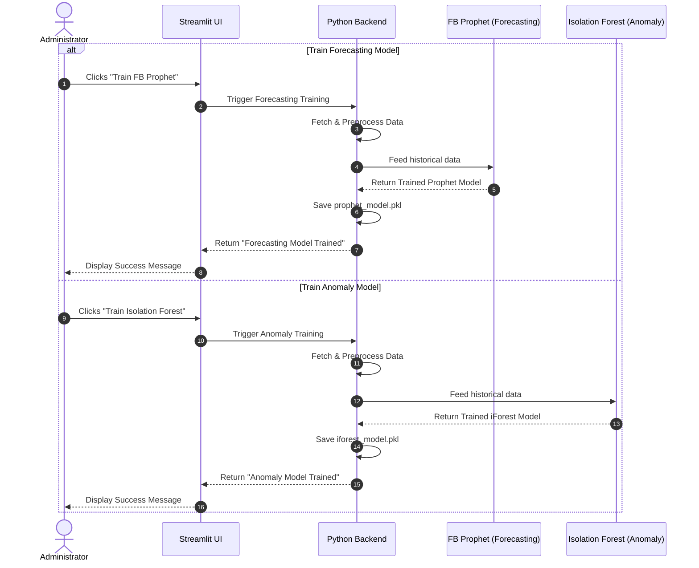

### 3.2 Add New Datasets & Retrain
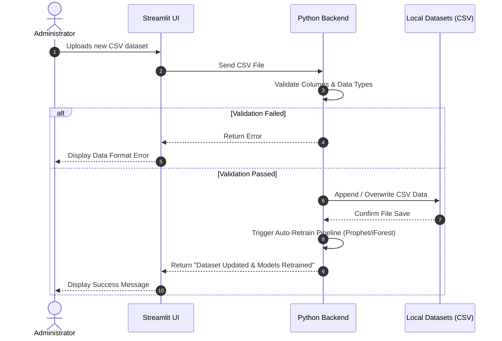

### 3.3 Manage Blockchain Ledger
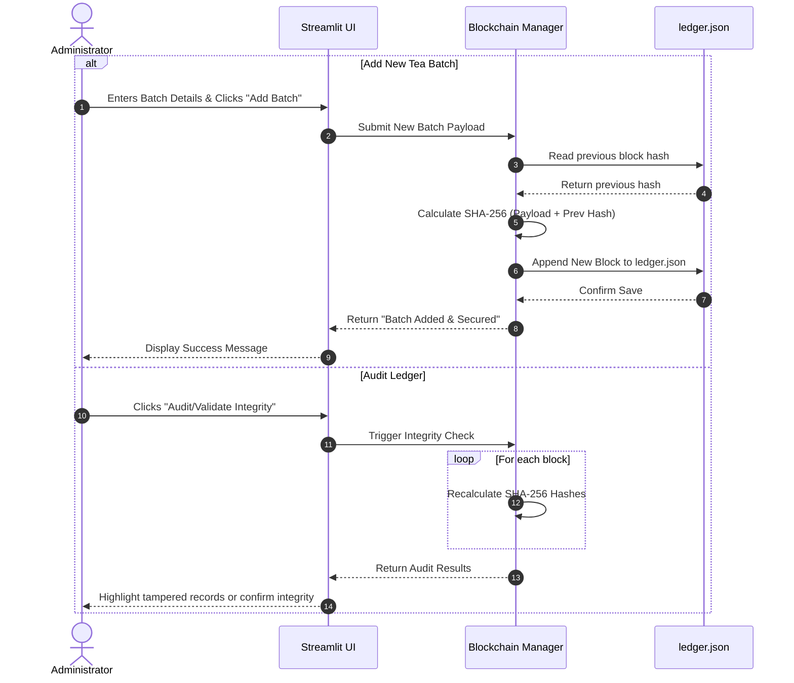

### 3.4 Manage Users (Add, Update, Remove)
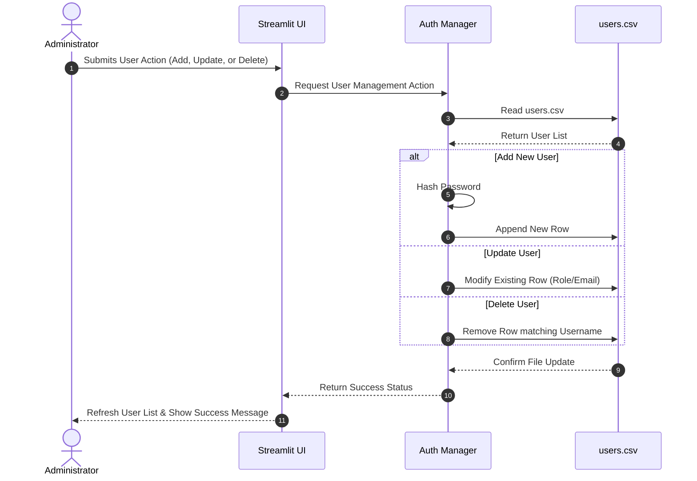
