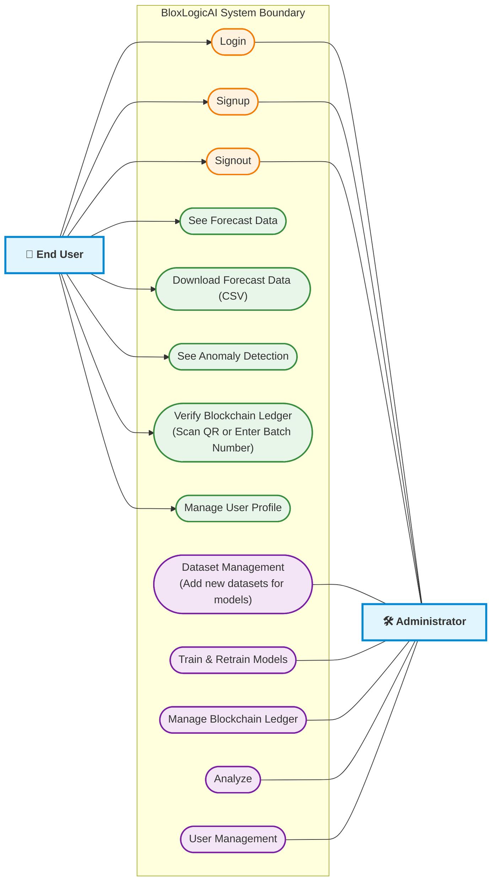

# BloxLogicAI Use Case Diagram

This Use Case Diagram outlines the specific interactions and capabilities available to the two primary actors within the BloxLogicAI system: **End Users** and **Administrators**.

