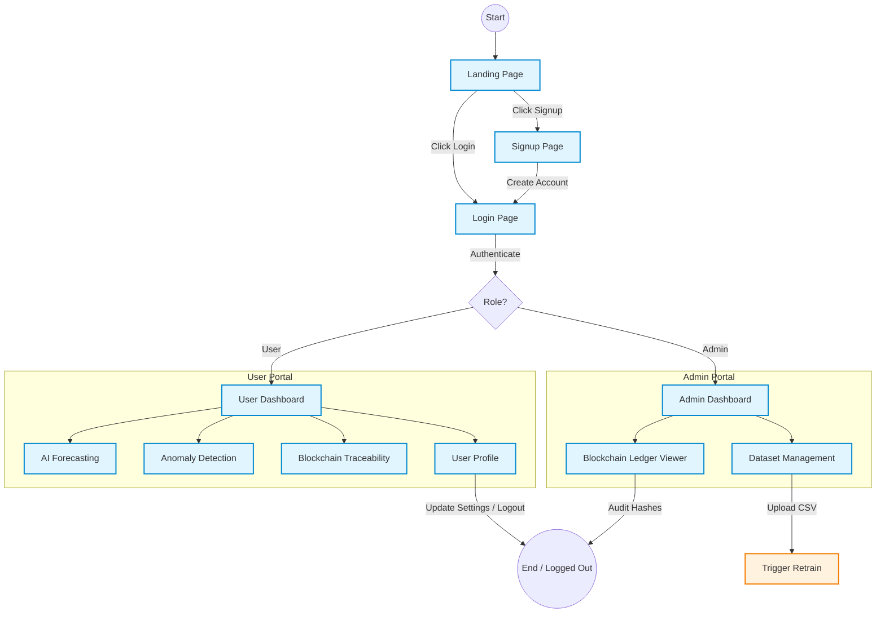

# BloxLogicAI User Flow Diagram

This diagram maps out the screens and paths a user can take when interacting with the BloxLogicAI platform.

```mermaid
flowchart TD
    %% Styling
    classDef page fill:#e1f5fe,stroke:#0288d1,stroke-width:2px;
    classDef action fill:#fff3e0,stroke:#f57c00,stroke-width:2px;
    
    %% Start
    Start((Start)) --> LP["Landing Page"]:::page
    
    %% Landing Page Routing
    LP -->|"Click Login"| LogIn["Login Page"]:::page
    LP -->|"Click Signup"| SignUp["Signup Page"]:::page
    
    %% Authentication
    SignUp -->|"Create Account"| LogIn
    LogIn -->|"Authenticate"| AuthCheck{"Role?"}
    
    %% Role Branching
    AuthCheck -->|"User"| UserDash["User Dashboard"]:::page
    AuthCheck -->|"Admin"| AdminDash["Admin Dashboard"]:::page
    
    %% User Flows
    subgraph "User Portal"
        UserDash --> Forecast["AI Forecasting"]:::page
        UserDash --> Anomaly["Anomaly Detection"]:::page
        UserDash --> BC_Trace["Blockchain Traceability"]:::page
        UserDash --> Profile["User Profile"]:::page
    end
    
    %% Admin Flows
    subgraph "Admin Portal"
        AdminDash --> DataMgmt["Dataset Management"]:::page
        AdminDash --> BCLedger["Blockchain Ledger Viewer"]:::page
    end
    
    %% End States
    Profile -->|"Update Settings / Logout"| LogOut((End / Logged Out))
    DataMgmt -->|"Upload CSV"| SuccessAction["Trigger Retrain"]:::action
    BCLedger -->|"Audit Hashes"| LogOut
```
